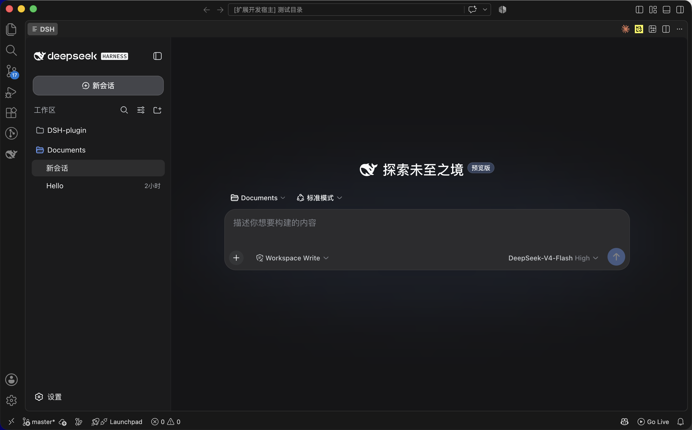
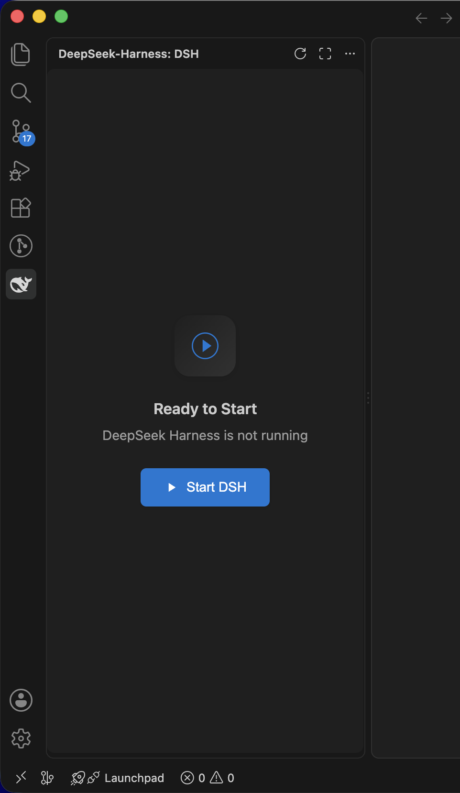
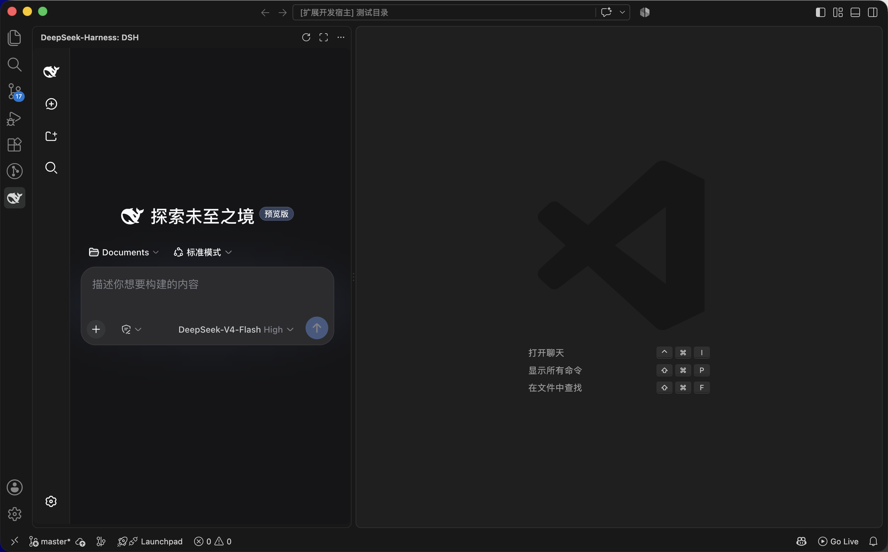
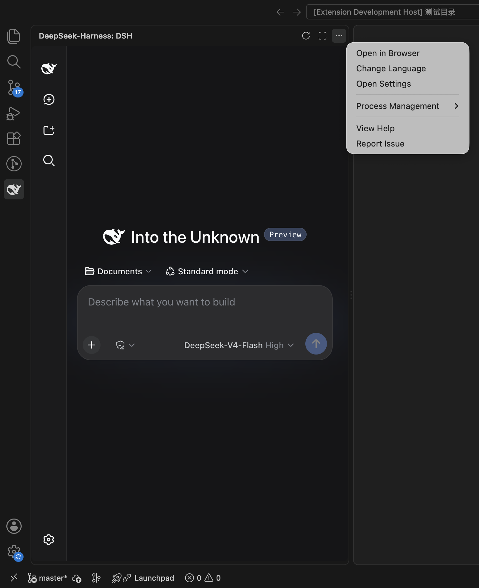

# DeepSeek Harness Web Integration

[](https://code.visualstudio.com/)
[](https://www.typescriptlang.org/)
[](LICENSE)

**Languages:** **English** | [简体中文](README.zh-cn.md)

A VSCode extension that integrates DeepSeek Harness (DSH) Web functionality into the sidebar.



## Features

- 🌐 **Multi-language Support**: Supports English, Simplified Chinese, Japanese, and Korean, automatically following VSCode interface language
- 🖥️ **Sidebar Integration**: Display DSH Web interface in VSCode sidebar
- 🚀 **Quick Launch**: Launch DSH directly from VSCode with a single command
- ⚙️ **Configurable**: Customize port and language settings
- 🔄 **Process Management**: Support restarting and stopping DSH processes

## Screenshots

### Start View

Click the "Start DSH" button to launch DSH directly from the sidebar:



### Sidebar View

Use DSH directly in the VSCode sidebar:



### Toolbar Menu

Refresh, open in editor/browser, view help, and manage the DSH process from the panel toolbar:



## Installation

### Prerequisites

1. Node.js >= 22.19.0 (verify with `node --version`). The extension checks this before starting DSH.

2. Install this extension from VSCode Marketplace (search "DeepSeek Harness Web Integration")

3. (Optional, recommended for faster startup) Globally install DeepSeek Harness (DSH). If the `dsh` command is not found, the extension automatically starts DSH via `npx -y @deepseek-ai/dsh web` instead (the first run may need to download the package):
   ```bash
   npm install -g @deepseek-ai/dsh
   ```

## Usage

### Launch DSH

1. Open the DSH-Web panel in the VSCode sidebar
2. Click the "Start DSH" button
3. Wait for the service to start
4. Start using it

### Connect to an External DSH Process

If you have already started a DSH service in a terminal or elsewhere, the extension can connect directly to it:

1. Open VSCode Settings (`Ctrl+,` / `Cmd+,`)
2. Search for `dsh-web.port` and change the port number to match the external process
3. Reopen the DSH-Web panel in the sidebar

### Process Management

In the sidebar toolbar:
- **Refresh Connection**: Refresh the DSH Web page
- **More Actions**:
  - Open in Editor
  - Open in Browser
  - View Help
  - **Process Management**:
    - Restart Process
    - Stop Process

## Configuration

You can configure this extension in VSCode Settings:

| Setting | Type | Default | Description |
|---------|------|---------|-------------|
| `dsh-web.port` | number | `3080` | DSH server port |
| `dsh-web.timeout` | number | `5000` | Connection timeout (milliseconds) |
| `dsh-web.language` | string | `auto` | Interface language (`auto`/`en`/`zh-cn`/`ja`/`ko`) |
| `dsh-web.preferNpx` | boolean | `false` | Prefer starting DSH via `npx -y @deepseek-ai/dsh web` instead of the globally installed `dsh` command. If enabled, no fallback to the `dsh` command on failure |

### Language Switching

The extension supports the following languages:
- **Auto**: Follow VSCode interface language
- **English (en)**
- **Simplified Chinese (zh-cn)**
- **Japanese (ja)**
- **Korean (ko)**

You can switch languages through:
1. Modify the `dsh-web.language` configuration in settings
2. Via the sidebar "More Actions" menu → "Change Language"

## License

MIT
